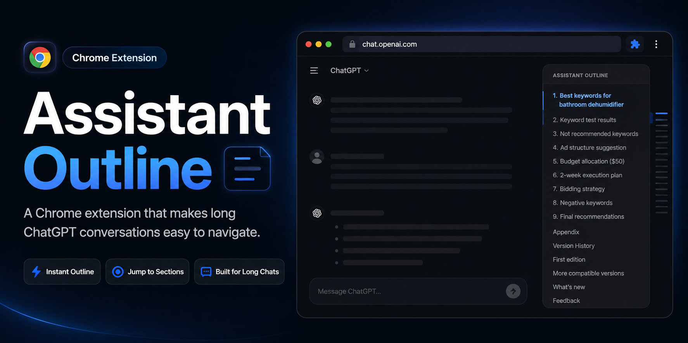

# ChatGPT Outline

[中文说明](README.zh-CN.md)

> A lightweight Chrome extension that adds a Notion-style outline rail to long ChatGPT conversations.

ChatGPT Outline turns long ChatGPT conversations into a calm right-side outline. It defaults to assistant response headings, can switch to user prompt navigation from the extension popup, and lets you jump back to the section or prompt you need without losing your place.

## Highlights

- **Made for long answers**: Navigate research notes, plans, code explanations, and multi-section replies faster.
- **Minimal by default**: The rail sits on the right edge as short markers, so it does not fight with the conversation.
- **Hover to inspect**: Move your cursor over the rail to reveal a Notion-style outline card.
- **Click to jump**: Select any heading and scroll directly to that part of the assistant response.
- **Assistant / user modes**: Use the toolbar popup or `Alt+Shift+O` to switch between assistant headings and user prompts.
- **Current section highlight**: The active marker follows your reading position.
- **Streaming friendly**: The outline updates while ChatGPT is still generating.
- **Avoids duplicate rails**: Hides ChatGPT's native conversation outline when it would overlap with this extension.

## Privacy

This extension is intentionally local and simple.

- No backend service.
- No AI API calls.
- No account system.
- No conversation upload.
- No bulk chat-history export.
- Reads only the current ChatGPT page DOM.
- Builds outline items from assistant / GPT headings by default, or user prompts when user mode is selected.

## How It Works

ChatGPT Outline scans messages on `chatgpt.com` and `chat.openai.com`. Assistant mode finds rendered assistant headings and chooses the highest available heading level for each response: `h1` first, then `h2`, then `h3`. User mode lists user messages as prompt summaries. The selected mode is stored locally in Chrome and can be changed from the extension popup or with `Alt+Shift+O`.

## Local Install

1. Open Chrome and go to `chrome://extensions`.
2. Enable **Developer mode**.
3. Click **Load unpacked**.
4. Select this project folder: `chatgpt-outline-extension`.
5. Open or refresh a ChatGPT conversation page.

After updating local files, reload the extension in `chrome://extensions` and refresh ChatGPT.

Files

- `manifest.json`: Chrome Manifest V3 configuration.
- `content.js`: DOM scanning, outline mode handling, scroll navigation, and native outline blocking.
- `content.css`: Right-side outline rail and hover card styling.
- `background.js`: Keyboard shortcut handling.
- `popup.html`, `popup.css`, `popup.js`: Toolbar popup mode switch.
- `icons/`: Extension icons.
- `assets/preview.png`: README preview image.
- [Latest release download](https://github.com/GhostwithBlade/chatgpt-outline-extension/releases/latest): Packaged extension build.

Known Limitations

ChatGPT's page structure can change. If the outline stops working, check the selectors and detection logic in `content.js`, especially:

- `findAssistantContentRoots()`
- `classifyHeading()`
- `getHeadingCandidates()`
- `findNativeOutlineCandidates()`

## Roadmap

- Outline search.
- Export current outline as Markdown.
- More resilient ChatGPT DOM adapter.
