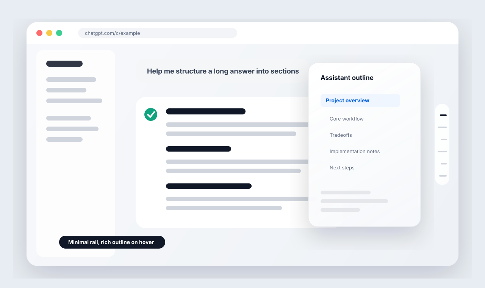

# ChatGPT Outline

[中文说明](README.zh-CN.md)

> A lightweight Chrome extension that adds a Notion-style outline rail to long ChatGPT conversations.

ChatGPT Outline turns long assistant answers into a calm right-side outline. It stays out of the way as small gray bars, expands into readable headings on hover, and lets you jump back to the section you need without losing your place.

## Highlights

- **Made for long answers**: Navigate research notes, plans, code explanations, and multi-section replies faster.
- **Minimal by default**: The rail sits on the right edge as short markers, so it does not fight with the conversation.
- **Hover to inspect**: Move your cursor over the rail to reveal a Notion-style outline card.
- **Click to jump**: Select any heading and scroll directly to that part of the assistant response.
- **Current section highlight**: The active marker follows your reading position.
- **Streaming friendly**: The outline updates while ChatGPT is still generating.
- **Avoids duplicate rails**: Hides ChatGPT's native conversation outline when it would overlap with this extension.

## Privacy

This extension is intentionally local and simple.

- No backend service.
- No AI API calls.
- No account system.
- No conversation upload.
- No bulk chat-history export.
- Reads only the current ChatGPT page DOM.
- Builds outline items only from assistant / GPT output headings.

## How It Works

ChatGPT Outline scans assistant messages on `chatgpt.com` and `chat.openai.com`, finds rendered headings, and chooses the highest available heading level for each response: `h1` first, then `h2`, then `h3`. User messages are ignored, so the outline stays focused on the answer content.

## Local Install

1. Open Chrome and go to `chrome://extensions`.
2. Enable **Developer mode**.
3. Click **Load unpacked**.
4. Select this project folder: `chatgpt-outline-extension`.
5. Open or refresh a ChatGPT conversation page.

After updating local files, reload the extension in `chrome://extensions` and refresh ChatGPT.

Files

- `manifest.json`: Chrome Manifest V3 configuration.
- `content.js`: DOM scanning, heading extraction, scroll navigation, and native outline blocking.
- `content.css`: Right-side outline rail and hover card styling.
- `icons/`: Extension icons.
- `assets/preview.svg`: README preview image.
- `chatgpt-outline-v0.1.19.zip`: Packaged extension build.

Known Limitations

ChatGPT's page structure can change. If the outline stops working, check the selectors and detection logic in `content.js`, especially:

- `findAssistantContentRoots()`
- `classifyHeading()`
- `getHeadingCandidates()`
- `findNativeOutlineCandidates()`

## Roadmap

- Outline search.
- Settings popup.
- Export current outline as Markdown.
- More resilient ChatGPT DOM adapter.
